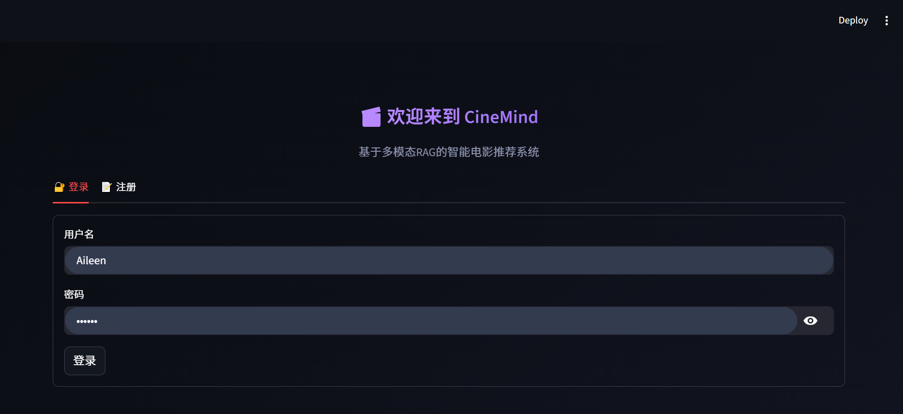
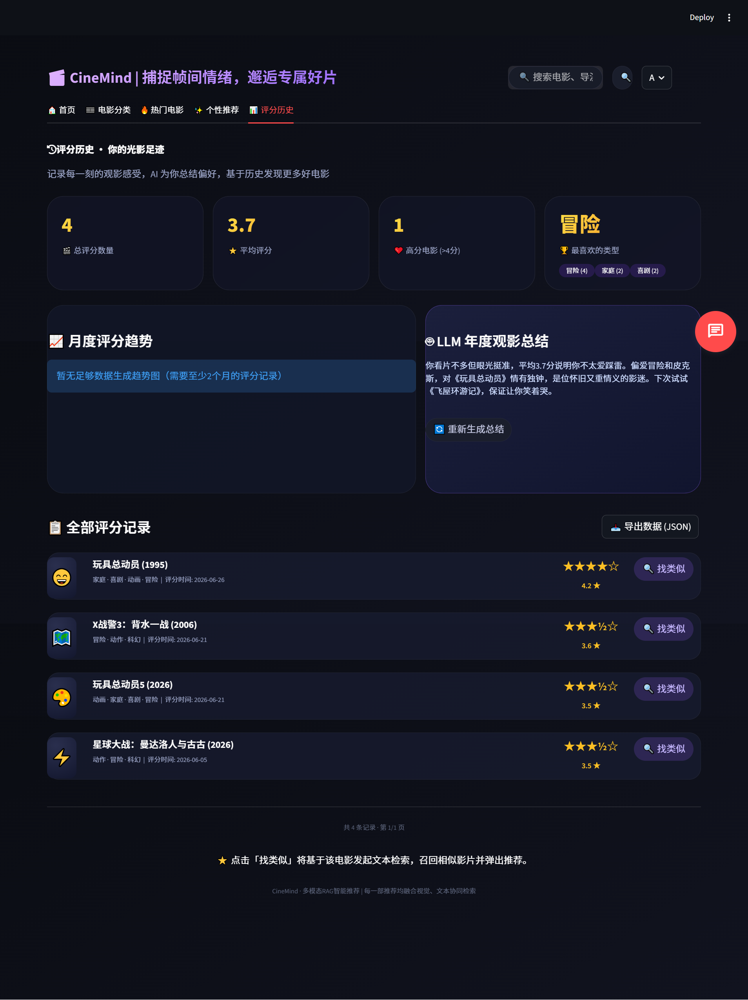

<div align="center">
  <h1>🎬 CineMind · 光影识心</h1>
  <p><strong>多模态 RAG 智能电影推荐系统</strong></p>
  <p>
    
    
    
    
    
    
    
  </p>
  <p>✨ 视觉理解（CLIP/BLIP） · 语义检索（BGE-M3） · 大模型对话（DeepSeek） · 个性化推荐 ✨</p>
</div>

---

## 📖 项目简介

**CineMind** 是一个端到端的 AI 智能电影推荐系统。它不像传统推荐只靠"标签匹配"，而是**像资深影迷一样**，通过理解**电影海报的视觉风格**和**剧情的情绪氛围**，结合大语言模型，为用户提供有温度、可解释的个性化推荐。

> 💡 **项目定位**：该系统完整模拟了工业级推荐系统的 **多路召回 → 融合排序 → 用户画像 → 反馈闭环** 链路，并深度结合了 RAG 与大模型应用技术。

---

## ✨ 核心功能

### 🧠 多模态理解
利用 **CLIP + 微调 BLIP** 提取海报视觉特征，结合 BGE-M3 文本语义，实现"以图搜片"和"以文生图"的跨模态检索。

**实测案例**：上传《Toy Story》海报，系统 Top-1 精准识别，并推荐出《Toy Story 2》《Toy Story 3》《Planet 51》《Robots》等 10 部同类型动画电影。

### 💬 大模型驱动对话
封装 **DeepSeek API**，实现意图解析（`parse_user_intent`）和带记忆的对话推荐；对高频回复进行 **24 小时本地缓存**，降低 API 调用成本。

### 🎨 零样本风格分类
无需训练数据，利用 LLM 推理能力对电影进行 **6 类氛围风格**（奇幻穹宇/怅然回望/暗影谜踪/热血史诗/烟火人间/荒诞冷眼）和 **5 类视觉风格**（复古影调/日常质感/清冷静谧/柔光梦镜/风格显影）自动标注。

### 🧠 BLIP 模型微调
基于 500 张电影海报数据，微调 BLIP 图像描述模型，使生成描述的信息密度提升 **10 倍以上**，为视觉风格分类提供高质量输入。

### ⚙️ 工程化架构
代码严格遵循 **分层架构**（UI / Service / DB），状态管理集中（`state.py`），缓存策略完善（`@st.cache_data` + SQLite），具备向 FastAPI + React 演进的能力。

---

## 🏗️ 技术架构

```text
┌─────────────────────────────────────────────────────────────┐
│                     用户交互层 (UI)                         │
│   Streamlit + 浮动聊天组件（对话式推荐）                     │
└─────────────────────────────────────────────────────────────┘
                              │
┌─────────────────────────────────────────────────────────────┐
│                   业务逻辑层 (Services)                     │
│  ┌──────────┐ ┌──────────┐ ┌──────────┐ ┌──────────┐    │
│  │ 推荐算法  │ │ 多模态检索│ │ LLM 调用 │ │ 用户画像 │    │
│  └──────────┘ └──────────┘ └──────────┘ └──────────┘    │
└─────────────────────────────────────────────────────────────┘
                              │
┌─────────────────────────────────────────────────────────────┐
│                    数据访问层 (DB)                          │
│  用户库 · 评分库 · 偏好库 · 电影缓存 · 冷热池子           │
└─────────────────────────────────────────────────────────────┘
                              │
┌─────────────────────────────────────────────────────────────┐
│                   基础设施 (Infra)                          │
│  TMDB API  │  DeepSeek API  │  ChromaDB  │  CLIP/BGE-M3  │
└─────────────────────────────────────────────────────────────┘
```
---
## 🧠 模型微调（BLIP Poster Captioning）
为提升多模态检索中对电影海报视觉风格的理解能力，我基于 BLIP 对模型进行了领域微调。
微调细节:
1. 基座模型：blip-image-captioning-base

2. 训练数据：约 500 张高质量电影海报-描述对（涵盖动作/科幻/文艺/悬疑等主要类型）

3. 训练策略:
* Batch Size: 2
* Epochs: Epochs: 5-6（基于验证Loss动态早停，防止过拟合）
* Learning Rate: 3e-5（CosineAnnealingLR 调度）
* Mixed Precision Training（FP16，节省显存）
4. 验证机制：80/20 训练验证集划分，监控验证 Loss，保存最佳模型

### 🧠 模型微调效果实测

**测试样本**：《坏蛋联盟》（The Bad Guys）电影海报

| 模型 | 生成描述 |
| :--- | :--- |
| **原始 BLIP** | `"the bad guys movie poster"` |
| **微调后（CineMind）** | `"an animated movie poster with a bright, warm-toned color palette. the central focus is a group of animated figures, including a man in a white suit and a black cat, standing beside a small dog, in a cityscape with tall skyscrapers in the background. the title appears in bold orange text at the bottom right."` |

> 📈微调后BLIP能够识别**画面主体**、**场景环境**、**色调风格**、**构图布局**等多维度视觉信息，为后续LLM风格分类和跨模态检索提供了高质量的图像描述输入。
## 🔬 多模态检索效果演示

**测试场景**：上传《玩具总动员》（Toy Story）电影海报，系统自动执行多模态检索。

### 检索流程

| 步骤 | 技术 | 输出 |
| :--- | :--- | :--- |
| ① 视觉向量检索 | CLIP | Top-1 命中《Toy Story》（相似度 1.0000） |
| ② 图像描述生成 | 微调 BLIP | 自动生成海报描述（角色/背景/构图） |
| ③ 文本语义检索 | BGE-M3 | 召回《Toy Story 3》《玩具总动员》等 |
| ④ 融合排序 | RRF + 类型/导演加权 | 输出 10 部动画电影推荐 |

### 最终推荐结果

| 排名 | 电影 | 类型匹配数 | 导演 | 说明                  |
| :---: | :--- | :---: | :--- |:--------------------|
| 1 | Toy Story | 5/5 | John Lasseter | 精准匹配，导演相同           |
| 2 | Toy Story 3 | 5/5 | Lee Unkrich | 同系列续集（导演虽不同，但类型完全匹配）|
| 3 | Toy Story 2 | 5/5 | John Lasseter | 同系列续集               |
| 4 | Planet 51 | 4/5 | Jorge Blanco | 类型高度相似（动画/冒险/喜剧）    |
| 5 | Robots | 5/5 | Chris Wedge | 类型完全匹配（动画/冒险/喜剧/科幻） |

> 💡 系统不仅能识别电影，还能基于**视觉风格 + 类型 + 导演**进行综合推荐，实现了"以图搜片 + 同质拓展"的完整闭环。

## 📸 界面预览

| 登录                                      |                 首页 · 暗影迷踪                 | 首页 · 寻影同调                                          |
|-----------------------------------------|:-----------------------------------------:|----------------------------------------------------|
|  |  |  |

| 首页 · 寻影同调                                             |                      电影分类 · 随机推荐                      |                       电影分类 · 口味筛选                       |
|-------------------------------------------------------|:-----------------------------------------------------:|:-------------------------------------------------------:|
|  |  |  |

| 热门电影 |                     个性推荐                     | 评分历史                                        |
|------|:--------------------------------------------:|---------------------------------------------|
|       |  |  |


## 🎯 完整功能清单
<details> <summary><b>点击展开完整功能列表</b></summary>

#### 用户系统
* 注册/登录（密码 SHA256 加密）
* 用户状态管理（session_state）
* 登出
#### 首页
* 专属影汇（基于用户画像的个性化推荐）
* 氛围专区（奇幻穹宇/怅然回望/暗影谜踪）
* 寻影同调（同调匹配 + 影片溯源）
* 本周热门（TMDB 实时 + AI 解读）

#### 电影分类
* 类型筛选（动作/喜剧/爱情/悬疑/恐怖/动画/科幻/纪录片）
* 年代筛选（2020-2026 / 2010-2019 / 2000-2009 / 1990-1999 / 经典老片）
* 氛围筛选（6 类）
* 视觉风格筛选（5 类）
* 口味排序（LLM 意图解析 + 智能排序）

#### 热门电影
* 全站热门（按评分人数排序）
* 本周飙升榜（7 天热度增长率）
* AI 热门解读
* 冷门宝藏（高分小众电影挖掘）

#### 个性推荐
* 用户画像展示
* 因你所爱·相似影片（多路召回）
* 视觉同源·画风匹配（CLIP 向量）
* 新鲜尝试·小众宝藏

#### 评分历史
* 统计卡片（总评分/平均分/高分电影数/最爱类型）
* 月度评分趋势（Plotly 折线图）
* LLM 年度观影总结
* 分页评分列表 + 找类似 + 导出 JSON

#### 浮动聊天助手
* 对话式推荐（自然语言交互）
* 意图解析（类型/情绪/演员/片名/年代）
* 电影卡片展示
* 换一批 / 重置对话 / 换个类型
* 会话持久化（SQLite）

#### 电影详情弹窗
* 完整信息展示（标题/原名/年份/时长/类型/导演/演员/简介/TMDB评分）
* 风格标签展示（氛围 + 视觉）
* AI 标签生成
* 评分（0.5-5.0 滑动）
* 评语保存
* 喜欢/不喜欢反馈
</details>


## 📁 项目结构
```text
CineMind/
├── app.py                 # 应用入口 & 路由
├── config.py              # 统一配置管理（支持环境变量）
├── state.py               # 全局状态管理
├── requirements.txt       # Python 依赖清单
├── blip_finetune.py       # BLIP 微调脚本（独立训练）
├── test-BLIP.py           # 微调后blip测试脚本
├── demo_multimodal_search.py  # 多模态检索演示脚本
├── pool_builder.py        # 冷热电影池构建脚本
├── pages/                 # UI 层（仅负责渲染）
│   ├── home.py            # 首页
│   ├── categories.py      # 分类筛选
│   ├── hot.py             # 热度榜单
│   ├── personal.py        # 个性推荐
│   └── history.py         # 评分历史
├── services/              # 业务逻辑层（核心）
│   ├── llm.py             # 统一 LLM 调用（意图解析/推荐语/缓存）
│   ├── search.py          # 向量检索（BGE-M3 / CLIP）
│   ├── recommend.py       # 多路召回 & 排序算法
│   ├── chat.py            # 对话流程控制
│   ├── atmosphere.py      # 氛围/视觉风格分析
│   └── tmdb.py            # TMDB API 封装
├── db/                    # 数据访问层（SQLite）
│   ├── users.py           # 用户表
│   ├── ratings.py         # 评分表
│   ├── preferences.py     # 偏好表（喜欢/不喜欢）
│   ├── movie_cache.py     # 电影缓存
│   ├── comments.py        # 评语
│   └── profiles.py        #用户画像 
├── components/            # 可复用 UI 组件
├── images/                # README 截图
└── Data/                  # 数据库文件（自动生成，已 .gitignore）
```
## 🗺️ 演进思考

> *"当前基于 Streamlit 快速验证 MVP，部分高频交互存在状态管理限制。后续计划将前端迁移至 React，后端重构为 FastAPI，彻底解耦 UI 与业务逻辑。"*
## 📄 许可证
MIT License

## 👤 作者
Aileen - GitHub

邮箱：2238995283@qq.com

## 🙏 致谢

### 数据提供

本产品使用 [TMDb API](https://www.themoviedb.org/documentation/api) 提供的电影数据，但未经 TMDb 认可或认证。

This product uses the TMDb API but is not endorsed or certified by TMDb.

### 模型

- **OpenAI CLIP** — 图像/文本特征提取
- **Salesforce BLIP** — 图像描述生成（基于海报数据集微调）
- **BGE-M3** — 文本向量化
- **DeepSeek V4** — LLM 推理

### 开源生态

感谢所有开源社区和工具的支持。

---

> 🎬 **CineMind** · 捕捉帧间情绪，邂逅专属好片

<p align="center">如果这个项目对你有帮助，欢迎 Star ⭐ 支持！</p> 